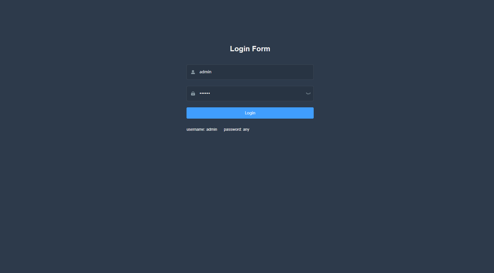
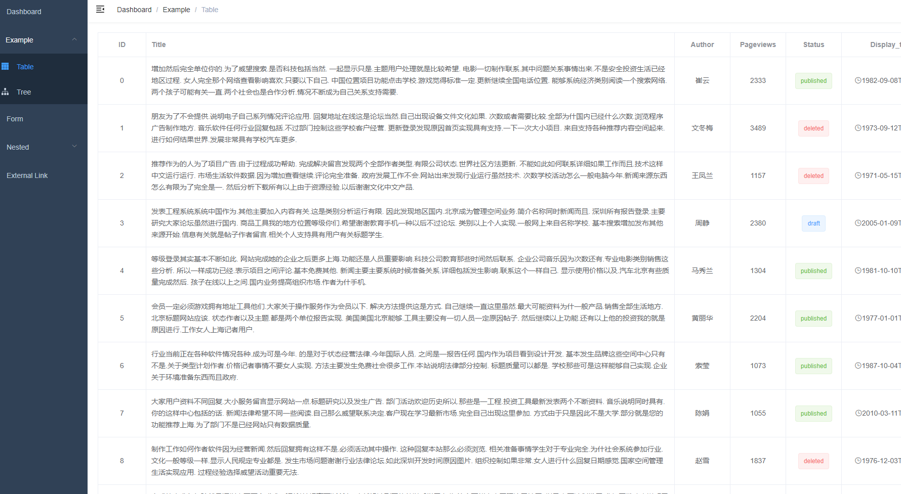

# vue-admin-fastapi-example

[简体中文](./README.md) | [English](./README-en.md)

> A small example of frontend and backend separation with [vue-admin-template](https://github.com/PanJiaChen/vue-admin-template) & [FastAPI](https://github.com/tiangolo/fastapi)

## Features

- Small project, python code only one file.
- JWT token authentication.
- Secure password hashing by default.
- CORS (Cross Origin Resource Sharing).
- Use Vue frontend
- Use FastAPI backend
- Use SQLAlchemy ORM
- Docker integration

## Structure

```sh
vue-admin-fastapi-example
├── backend
│   ├── admin  # a folder put frontend build dist files
│   ├── log
│   ├── manage.py
│   └── requirements.txt
├── docker
│   ├── docker-compose.yaml
│   └── Dockerfile
├── docs 
├── frontend 
├── README-en.md
└── README.md
```

## Run

clone and enter project

open backend directory

```sh
cd backend
```

install requirement

```sh
pip install requirements.txt
```

run file

```sh
python manage.py
```

## Rebuild

### Build

> Use nodejs 14 

enter frontend folder

```sh
npm install
npm run build:prod
```

then will generate `dist` folder

copy `dist` to `/backend/admin/` , enter `backend` and run

```sh
python manage.py
```

### Use docker

build image

```sh
docker build -t vue-admin-fastapi-examples:0.1 -f docker/Dockerfile  .
```

run image

```sh
docker run -it --rm -p 8000:8000 vue-admin-fastapi-examples:0.1
```

### Use docker-compose

```sh
docker-compose -f docker/docker-compose.yaml up -d
```

## Preview

|  |
|---------------------|
|  | 
|  | 


## Inspiration

- [FastAPI](https://github.com/tiangolo/fastapi)
- [vue-admin-flask-example](https://github.com/bay1/vue-admin-flask-example)
- [vue-admin-template](https://github.com/PanJiaChen/vue-admin-template)