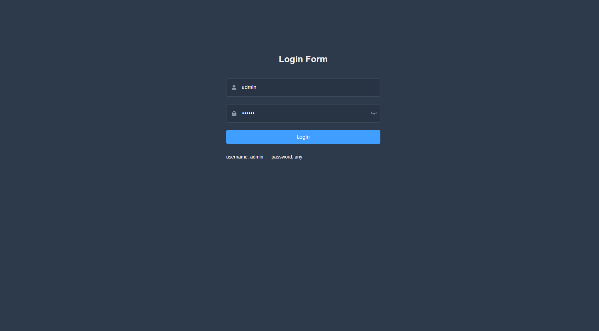

# vue-admin-fastapi-example

> [vue-admin-template](https://github.com/PanJiaChen/vue-admin-template)和[FastAPI](https://github.com/tiangolo/fastapi)前后端分离的小例子

- 项目小，python端只有一个文件
- 用户登陆，JWT令牌认证
- 密码哈希
- 前后端分离
- CORS跨域访问
- 使用FastAPI
- 使用SQLAlchemy ORM框架

## 项目结构

```sh
...
```

## 运行项目

克隆本项目，进入后

打开backend文件
```sh
cd backend
```

安装依赖
```sh
pip install requirements.txt
```

运行文件
```sh
python manage.py
```

## 重新构建

### 构建前端

在frontend目录下运行

```sh
npm install
npm run build:prod
```

将dist目录下的文件复制到 `/backend/admin/` 目录下,在backend目录下运行

```sh
python manage.py
```

## 项目预览

|  |
|---------------------|
|  | 
|  | 


## reference
- [vue-admin-flask-example](https://github.com/bay1/vue-admin-flask-example)
- [vue-admin-template](https://github.com/PanJiaChen/vue-admin-template)